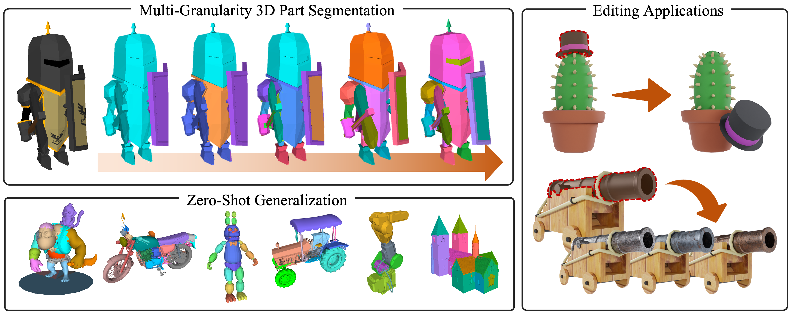
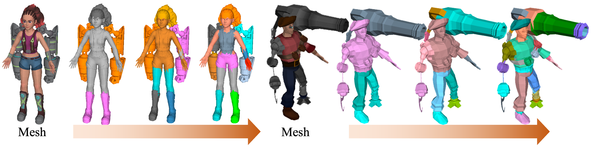
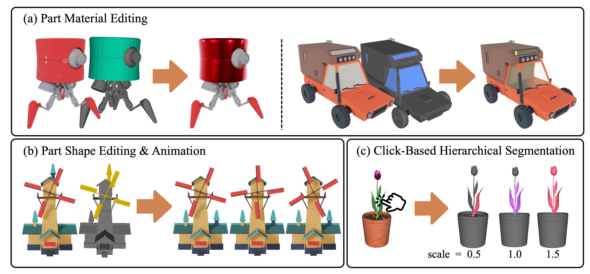

# 3D-SAP
**Paper and Codes will be coming soon.**

3D-SAP is able to segment any 3D object into semantic parts across multiple levels of granularity, without the need for predefined part label sets or text prompts. It supports a range of applications, including part-level editing and interactive segmentation.

## More Results
### Visualization of multi-granularity 3D part segmentation.

### Visualization of 3D part editing.

